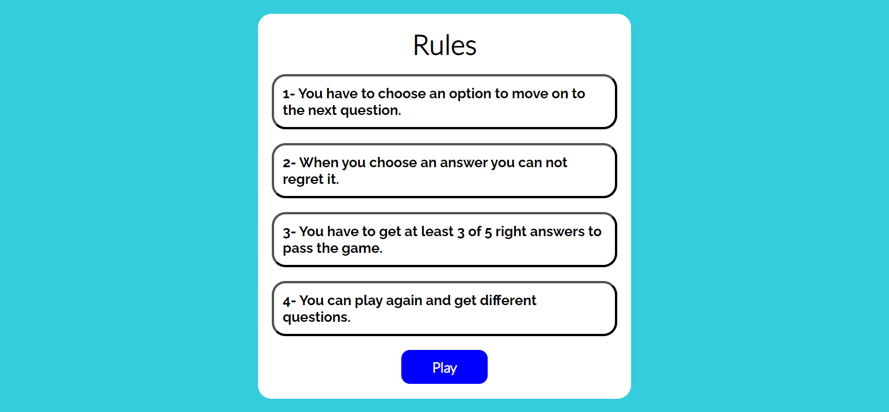
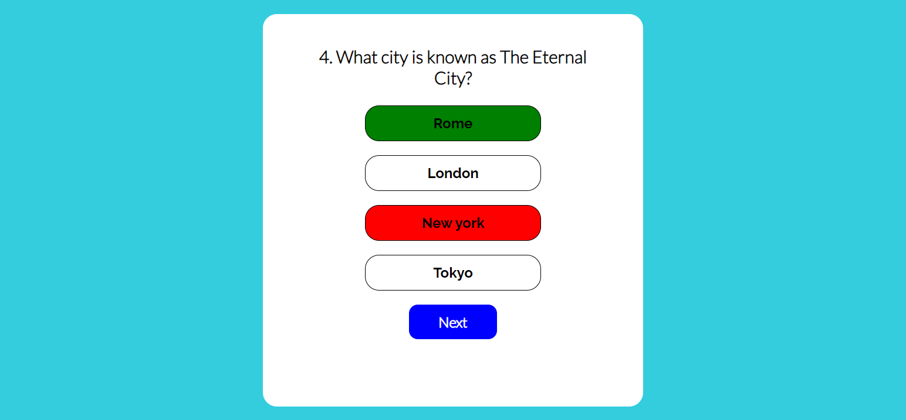
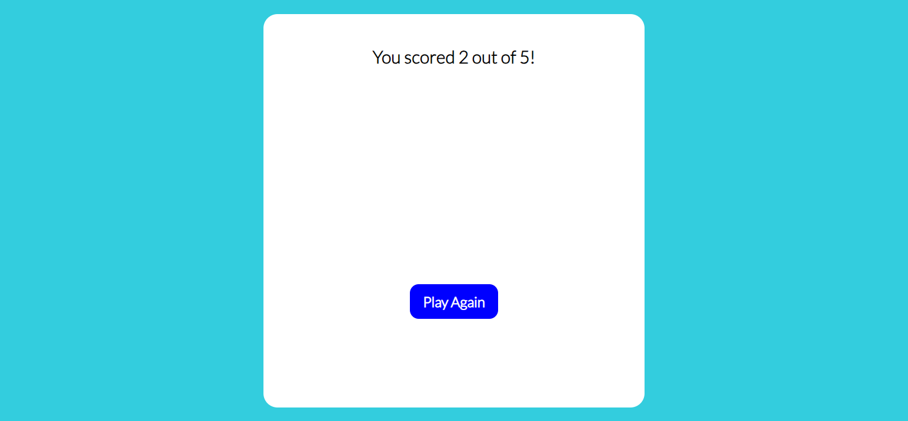

# Quiz To Learn

Quiz-to-learn is a website that aims to show how pure JavaScript works in a real-world setting and creates an effective way to promote learning and educational content. The site targets adults of various ages who enjoy playing quizzes and want to enhance their general knowledge and retain information better. Quiz-to-learn offers users a fun and effective way to learn, challenge themselves, and engage and compete with others, making it a valuable tool for education, entertainment, and personal development.

## Design

- __Color choice__
  - I used turquoise color in the background because I thought it would give the user a feeling of tranquility and stability
  - I used black color with the header because it gives a good contrast ratio with the turquoise

- __Typography__
  - I used Raleway bold style font with the title, it's easier to read because the letters are bold with some space in between
  - It is also used with answer buttons to make them pop up to the user as well as the footer
  - I used Lato thin style for questions to make them visually different from answer buttons
  - It is also used with score as it is an informative text as well

- __Layout__
  - The header comes first always a the top and because it's only a headline it's centered in the middle
  - The main content of the quiz game is just right after the header and it's most suitable to keep the quiz game centered as well.
  - The footer comes at last and it tells shortly the purpose of the quiz game. It should be at the same level as the header and main, centered as well.

## Features

### Existing Features

- __The Header__
  
  - Featured at the top of the page, the header shows the game name: Quiz To Learn and it is easy to see for the user.
  - It clearly tells the user what game they are playing.
  - It is clickable in case the user wants to restart the game.

- __The Rules section__
  
  - This will tell the user the game 
  rules before starting the game.

- __The quiz section__

  - This section will allow the user to play the quiz game. The user will be able to see the questions to answer as a part of the game.  
  - The user can answer the questions by choosing an answer. The answer alternatives are interactive buttons.
  - After choosing an answer, if the button turns green then that makes it known that the answer is correct, otherwise the button will turn red to make it clear that the answer is wrong and the right answer will be highlighted with green.
  - After answering the question the next button will be shown and the user can click on it to view the next question.
  
  

- __The score section__ 
 
  - This section will allow the user to see exactly how many correct answers they have provided.
  - The user have the opportunity to play again by clicking "Play again" button.

- __The footer__
  - The footer tells the user the purpose of this website.

### Additional Features to Implement

- add a timer for questions.
- add more questions with different categories or make them random.

## Testing

- I tested playing this game on different browsers: Chrome, Opera and Firefox.
- I confirmed that the header link restarts the game.
- I confirmed that all buttons work the way intended.
- I confirmed that the game results are always correct.
- I confirmed that the header, instructions, quiz and score text are all readable and easy to understand.
- I confirmed that the colors and fonts chosen are easy to read and accessible by running it through lighthouse in devtools.

### Bugs

#### Solved bugs

- The user could move on to the next question without choosing an answer. This was solved by making the button invisible until and unless the user makes a choice.
- The answer buttons still had hover effect even after making a choice. The solution was to activate the hover effect only when the buttons are enabled.

#### Unfixed Bugs

- No unfixed bugs

### Validator Testing

- HTML
  - No errors were returned when passing through the official [W3C validator](https://validator.w3.org/nu/?doc=https%3A%2F%2Fprogrammer-1991.github.io%2Fquiz-app-PP2%2F)
- CSS
  - No errors were found when passing through the official [(Jigsaw) validator](https://jigsaw.w3.org/css-validator/validator?uri=https%3A%2F%2Fprogrammer-1991.github.io%2Fquiz-app-PP2%2F&profile=css3svg&usermedium=all&warning=1&vextwarning=&lang=sv)
- JavaScript
  - No errors were found when passing through the official [Jshint validator](https://jshint.com/)
    - The following metrics were returned:
    - There are 8 functions in this file.
    - Function with the largest signature take 2 arguments, while the median is 0.
    - Largest function has 8 statements in it, while the median is 4.
    - The most complex function has a cyclomatic complexity value of 2 while the median is 1.5.

## Deployment

- The site was deployed to GitHub pages. The steps to deploy are as follows:
  - Create my github repository using the CI template
  - Build my workspace in codeanywhere
  - Put our basic file structure in place
  - Create my initial git commit and push my project files to github.
  - In the GitHub repository, navigate to the Settings tab
  - Check to the left "code and automation" and then click on Pages.
  - From the source section drop-down menu, select "deploy from a branch".
  - From the branch section click on "main" and choose main in the menu.
  - Then the page will be automatically refreshed with a detailed ribbon display to indicate the successful deployment.

The live link can be found here - <https://programmer-1991.github.io/quiz-app-PP2/>
## Credits

- The fonts used in the application was taken from [Google Fonts](https://fonts.google.com/).
- The structure of my project was based on [YouTube tutorial](https://www.youtube.com/watch?v=PBcqGxrr9g8).
   - I used in my project the same basic structure used in this toturial.
   - I copied selectAnswer, showQuestion, showScore and handleNextButton functions with major modifications.
   - I modified startQuiz function and added a for loop that picks randomly five different questions eachtime the user plays.
- The favicon used in the application was taken from [favicon io](https://favicon.io/).